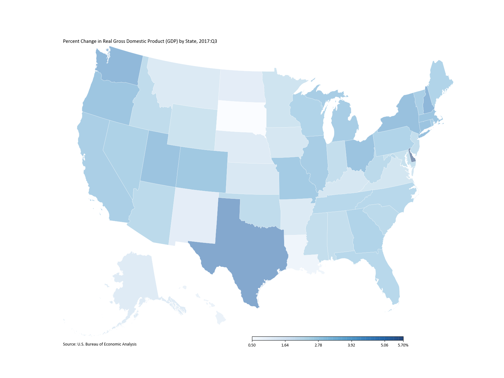

# U.S. choropleth maps from the command line
Python script that lets you generate from the command line quick U.S. choropleth maps at the state or the county level.

## Usage 

### Dependencies

[Pipenv](https://docs.pipenv.org/) is used for virtualenv/dependency management.

```bash
pipenv install
pipenv shell
```

### Try it out!

```bash
python US-choropleth.py ./data/qgdpstate0118_pctch.csv -g state -mg fullname -md state -c 2017Q3 -cm Blues -cbl % -p ESRI:102003 -t "Percent Change in Real Gross Domestic Product (GDP) by State, 2017:Q3" -ts "U.S. Bureau of Economic Analysis" -e svg -f "US-State-GDP-Change-2017Q3" -o
```



### Details

The script is based primarily on the powerful and easy-to-use Python libraries `geopandas` and `pandas` for generating and merging geographical dataframes, and `matplotlib` for generating charts, maps and other plots.

Cloning the repository, you download two pre-processed, ready-to-use geometry files: all 50 U.S. states and District of Columbia; and all 2010 U.S. Census Bureau counties and county equivalent entities. They are located in the `geometries` directory of the repository.

In order to use the script you need to pass at least one positional argument: the data set in `.csv` format you want to generate a choropleth map of.  

Your data set should have at least two columns:  

1. A column you will merge the existing geometry files with your data on; this column should store the U.S. states, in full name, or AP, ISO, FIPS, GPO, USPS, USGC style; or the U.S. counties following the U.S. Census Bureau 2010 FIPS Codes for Counties and County Equivalent Entities.  
2. A column with values you will generate the color-coding of the geometry shapes on.

In order to generate your map, customize its styles, and choose between different export options, you can use the optional arguments/flags below. Some arguments are required for generating the map (for example, the columns you are merging on, or the column you are color-coding on), and if you don't pass them in your script run, you will be prompted to input them later on (see instructions below).

#### Positional arguments

`data_file`: Path to the directory where your data set is living at.

#### Optional Arguments / Flags

`-g`, `--geometries`: Input `state` if you want to create a map at the state level or `county` if you want to create a map at the county level. If no argument is passed you will be prompted to input it later on. The geometry files for both levels live within the `geometries` directory.  

`-m`, `--merge-on`: Specify a column name shared by the geometries file and your data set to merge them on. If the two files don't share a common column name, use `--merge-on-geometries` and `--merge-on-data` to specify the individual column names. If no argument is passed, you will be prompted to input it later on.  
`-mg`, `--merge-on-geometries`: Specify the column name from the geometries file you want to merge with your data file on. If no argument is passed you will be prompted to input it later on. For state-level map, you can use only `fullname`, `AP`, `FIPS`, `GPO`, `ISO_3166`, `USCG`, `USPS`. For county-level map only `fullname` and `FIPS`.  
`-md`, `--merge-on-data`: Specify the column name from your data file you want to merge with the geometry file on. If no argument is passed you will be prompted to input it later on. Make sure the values in the data file column you merge on equal the values of the geometries file column (see below), or else geopandas will throw an error.  

`-c`, `--color-on`: Specify column name in your data file to color code the geometries (states or counties) on. If no argument passed you will be prompted to input it later on.  
`-cm`, `--color-map`: Matplotlib sequential color maps to use for color coding. If no argument passed, it defaults to `Reds`. See all possible choices (Perceptually Uniform Sequential, Sequential 1 and 2) at: https://matplotlib.org/examples/color/colormaps_reference.html.  
`-cbl`, `--colorbar-label`: Specify the label that will be used in the last bracket of the generated colorbar.

`-p`, `--projection`: Set your desired EPSG or ESRI projection. If no argument is passed, ESRI:102003 will be used. See possible EPSG and ESRI projections at: http://spatialreference.org/ref/epsg and at: http://spatialreference.org/ref/esri.  

`-t`, `--title`: Set title for the map. If not specified the name of the data file will be used.  
`-ts`, `--title-source`: Set source line. If not specified source line will return empty.

`-e`, `--extension`: Export your map to .PNG, .PDF, or .SVG. If not specified, it defaults to .PNG.  
`-f`, `--filename`: Set output filename. If not specified, the name of your data file will be used.  
`-o`, `--open-with`: Flag to request opening the output map with the default program. If not used, opening the output will be suppressed.  

## Known issues

- The script only works for data sets in `.csv` format. Expect support for `.json` files in the future.
- The script incorporates some error-checking, but for the time being expects you to get the column names you merging and color-coding on right at least the second time, or else `geopandas` will throw errors. Expect full error-checking in the future.
- `geopandas`/`pandas` mis-understanding numerical values for strings, causing stripping leading zeros from strings that look like numerical values.
- The look of the gradient in the generated colorbar.

## More examples

For state-level map:  

```bash
python US-choropleth.py ./data/qgdpstate0118_pctch.csv -g state -mg fullname -md state -c 2017Q3 -cm Blues -cbl % -p ESRI:102003 -t "Percent Change in Real Gross Domestic Product (GDP) by State, 2017:Q3" -ts "U.S. Bureau of Economic Analysis" -e svg -f "US-State-GDP-Change-2017Q3" -o
```


For county-level map:

```bash
python US-choropleth.py ./data/DEC_10_SF1_H6_with_ann_pcts.csv -g county -m FIPS  -c non_white_householder_pct -cm Oranges -cbl % -p ESRI:102003 -t "Percent of Non-White or Mixed-Race Householders in Occupied Housing Units" -ts "2010 U.S. Decennial Census" -e png -f "US-County-Non-White-Householders" -o
```


#### U.S. State codes

* FIPS Codes for the States and the District of Columbia: https://www.census.gov/geo/reference/ansi_statetables.html.  
* ISO 3166: https://www.iso.org/obp/ui/#iso:code:3166:US.  
* USPS: https://pe.usps.com/text/pub28/28apb.htm.  
* GPO: https://www.gpo.gov/fdsys/pkg/GPO-STYLEMANUAL-2000/html/GPO-STYLEMANUAL-2000-13.htm.  
* USCG, AP: https://en.wikipedia.org/wiki/List_of_U.S._state_abbreviations.  

#### U.S. County FIPS Codes

* 2010 FIPS Codes for Counties and County Equivalent Entities: https://www.census.gov/geo/reference/codes/cou.html.

#### Acknowledgements

Original geometry GeoJSONs from: https://github.com/hrbrmstr/albersusa/tree/master; the Stack Overflow community.